# IoTFlow Architecture - PostgreSQL for Telemetry Storage

## System Architecture with PostgreSQL Replacing IoTDB

This document outlines the architecture where PostgreSQL handles both metadata and telemetry data, replacing Apache IoTDB.

---

## High-Level Architecture

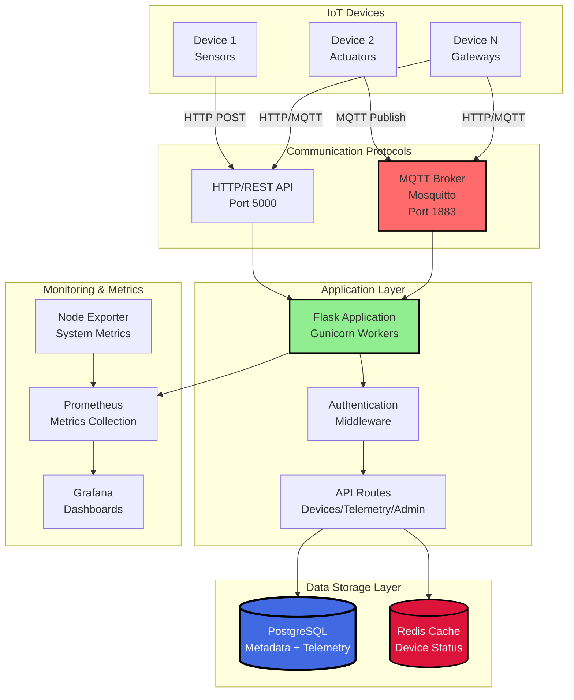

---

## Detailed Component Architecture

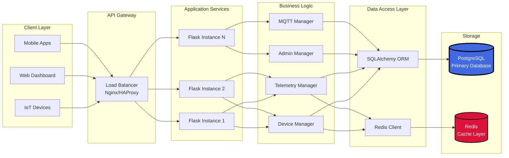

---

## PostgreSQL Database Schema with Telemetry

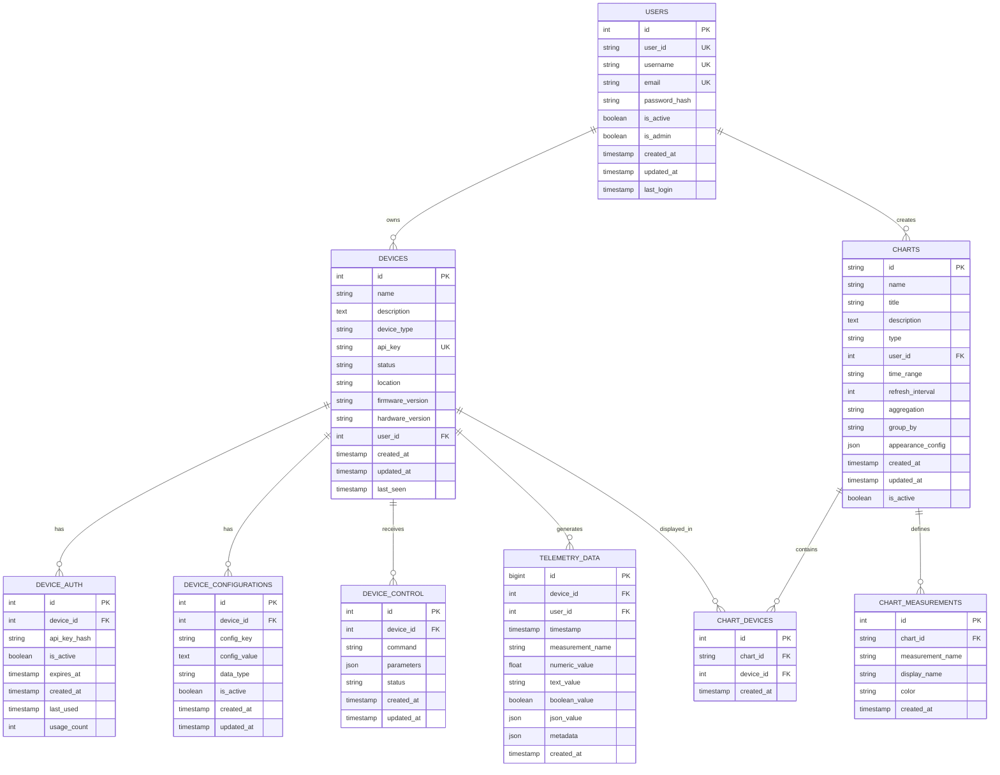

---

## Data Flow Architecture

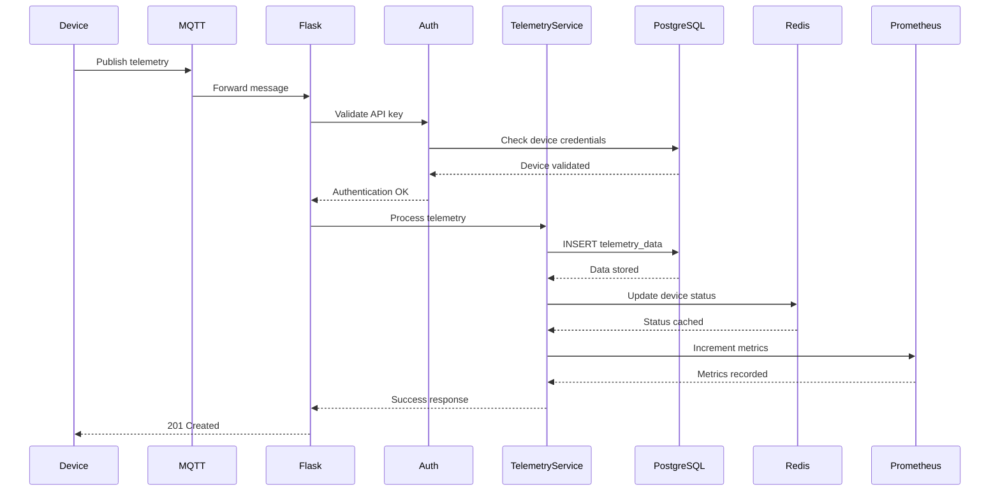

---

## Telemetry Query Flow

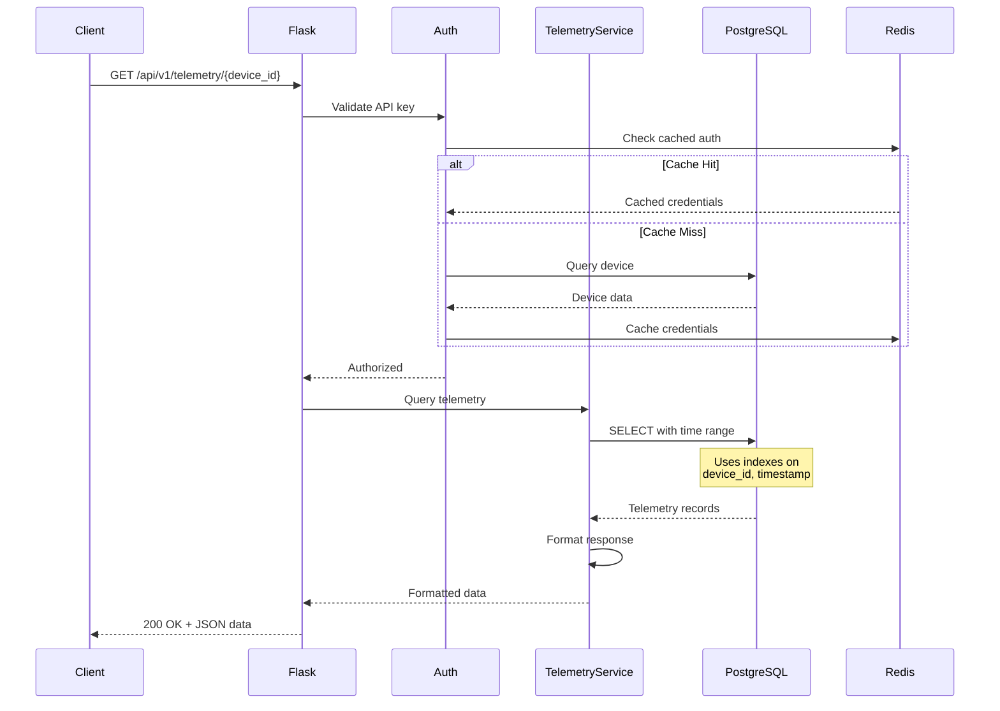

---

## PostgreSQL Telemetry Table Design

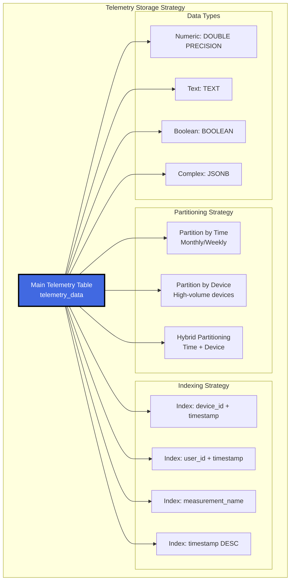

---

## Caching Strategy

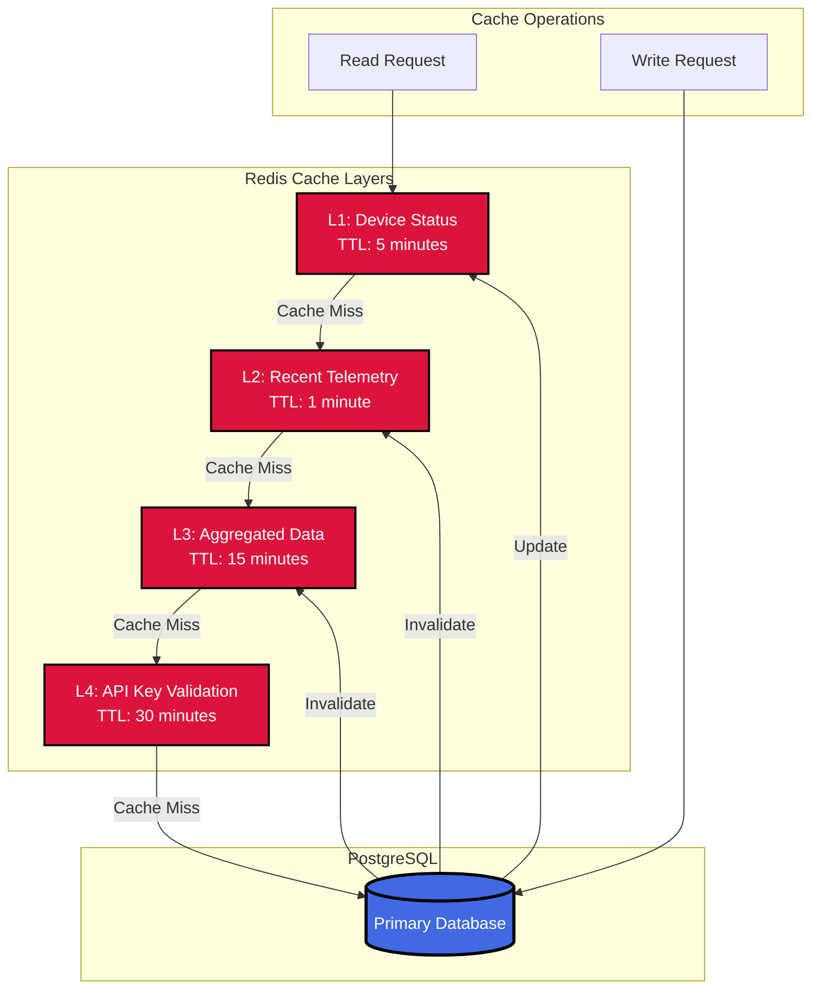

---

## Deployment Architecture

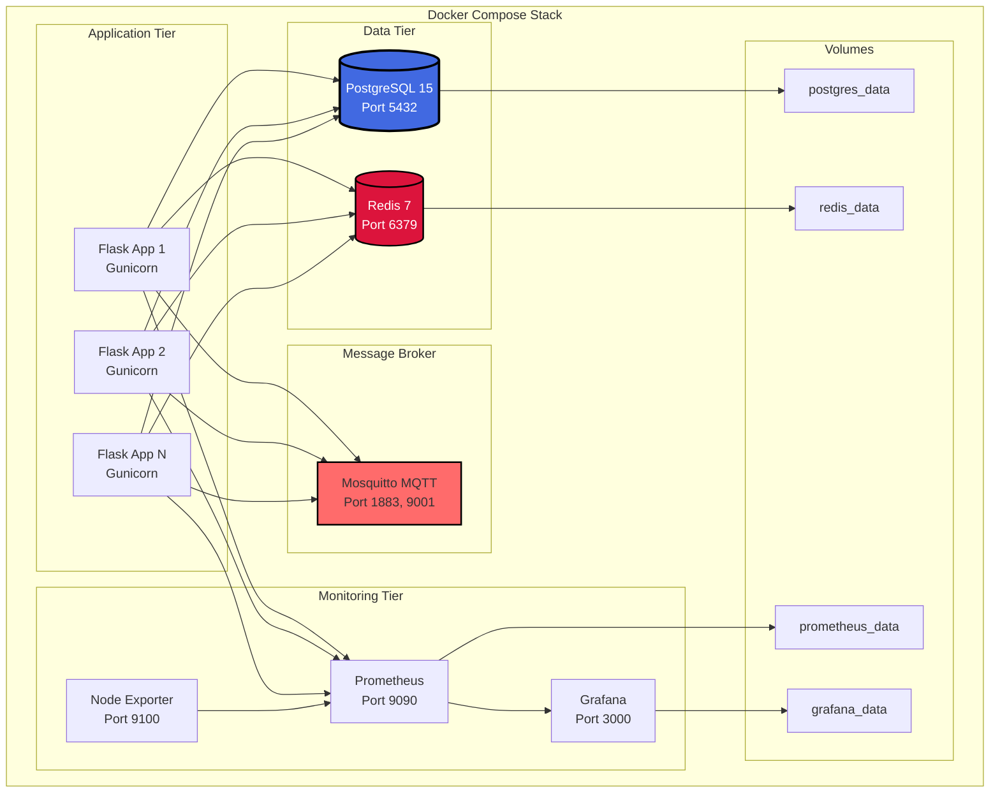

---

## Performance Optimization Strategy

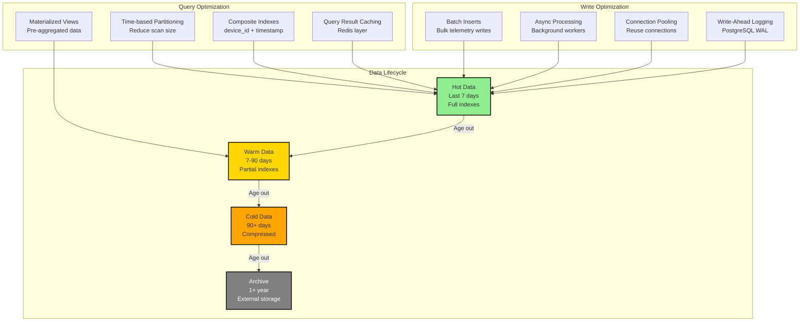

---

## Migration Path from IoTDB to PostgreSQL

```mermaid
graph LR
    subgraph "Phase 1: Preparation"
        P1A[Create telemetry_data table]
        P1B[Set up partitioning]
        P1C[Create indexes]
    end

    subgraph "Phase 2: Dual Write"
        P2A[Write to both IoTDB & PostgreSQL]
        P2B[Validate data consistency]
        P2C[Monitor performance]
    end

    subgraph "Phase 3: Migration"
        P3A[Export historical data from IoTDB]
        P3B[Transform data format]
        P3C[Bulk import to PostgreSQL]
    end

    subgraph "Phase 4: Cutover"
        P4A[Switch reads to PostgreSQL]
        P4B[Stop IoTDB writes]
        P4C[Decommission IoTDB]
    end

    P1A --> P1B --> P1C
    P1C --> P2A --> P2B --> P2C
    P2C --> P3A --> P3B --> P3C
    P3C --> P4A --> P4B --> P4C

    style P4C fill:#90EE90,stroke:#000,stroke-width:3px
```

---

## Key Benefits of PostgreSQL for Telemetry

1. **Unified Database**: Single database for metadata and telemetry
2. **ACID Compliance**: Strong consistency guarantees
3. **Rich Query Language**: Full SQL support with CTEs, window functions
4. **JSON Support**: Native JSONB for flexible telemetry formats
5. **Mature Ecosystem**: Extensive tooling and monitoring
6. **Horizontal Scaling**: Citus extension for sharding
7. **Time-series Extensions**: TimescaleDB for optimized time-series
8. **Backup & Recovery**: Robust backup solutions (pg_dump, WAL archiving)

---

## Recommended PostgreSQL Extensions

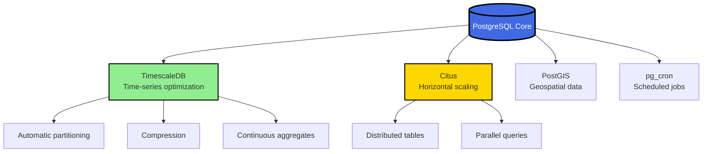

